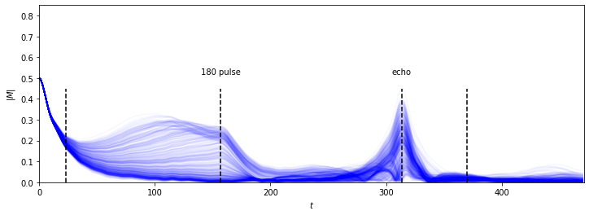
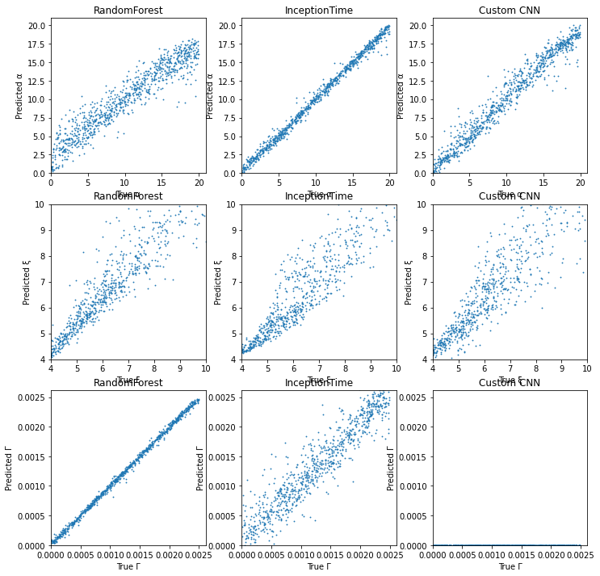
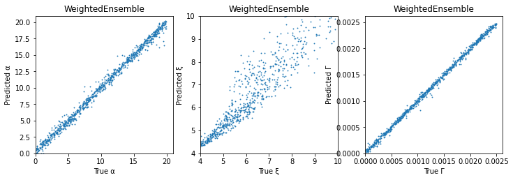
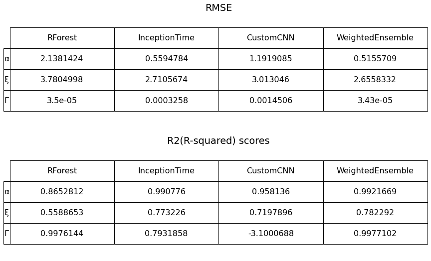

# Decoding quantum states through nuclear magnetic resonance
## Aim
The aim of this task was to design a machine learning model which could predict the coupling parameters associated with nuclei and electrons given their time-dependent magnetization `M(t)` curve from a spin-echo experiment. The parameters include `α` - coupling strength, 	`ξ` - coupling length, `Γ` - dissipation, etc. The model only takes in the `M(t)` curve as input and would help to study if a spin-echo experiment can provide sufficient information to 'reverse engineer' the coupling parameters from an `M(t)` curve.

This work was done as a part of the evaluation task for the [ML4SCI NMR](https://ml4sci.org/gsoc/2021/proposal_NMR.html) project.

The credit for designing the task and the dataset goes to the authors mentioned [here](https://ml4sci.org/gsoc/2021/proposal_NMR.html).

## Dataset

The dataset consisted of 6000 independent `M(t)` curves along with their associated `α`, `ξ` and `Γ` values. Visualizing first 500 curves with |M| (absolute value of M), as the values of M(t) complex numbers:

## Model Architecture

The final result was predicted using a weighted ensemble model comprising of three subnetworks:
1. **Random Forest over statistical features** like autocorrelation and partial autocorrelation, kurtosis,  autoregressive (AR) coefficients,  quantiles, c3 stats (non-linearity), fourier transform stats, etc.
2. **InceptionTime** - SOTA model for time series tasks
3. A **custom CNN** - for feature extraction and regression

The weighted average of predictions from these subnetworks were considered as final predictions. Weights of the weighted average model were learnt from our dataset while training.

## Results

### Individual Subnetwork Predictions:

### Final predictions:

### Evaluation scores:

## Conclusion
`α` was successfully predicted from InceptionTime and CNN. `Γ` was successfully predicted from RandomForest. `ξ` was best predicted from all three equally.

Better methods for `ξ` have to be modeled.

## Credits

This work was done as a part of the evaluation task for the [ML4SCI NMR](https://ml4sci.org/gsoc/2021/proposal_NMR.html) project.

The credit for designing the task and the dataset goes to the authors mentioned [here](https://ml4sci.org/gsoc/2021/proposal_NMR.html).
